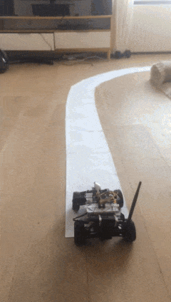

# Mini Self-Driving Car

Here's a small self driving car project. It is end-to-end - straight from image to motor actions.
Read the blogpost form writeup [here](https://ghostfacekillah.github.io/car.html).
I did this in 2017 (!), and now I see that this has aged a bit (felt cute might delete later).
It still has a bunch of value, and, please excuse me patting myself on the back, is still quite cool. 

It runs a neural net that steers the car to stay on the road made from white pieces of paper.
In 2017 I thought that's impressive that it is possible at all to pull it off as side project in the proverbial garage'n'basement circumstances.
Now it's 2023 and [people are driving real cars on the road in a simliar fashion, end to end](https://github.com/commaai/openpilot)
using open source projects 🤯. 

Anyway, here's how it works:

 

So the main steps are:
- Teleop the car and thus gather training data: pairs of `(image, steering inputs from human)`
- Train neural network on those pairs
- Have the trained neural network control the car

The repo doesn't have `requirements.txt` because I didn't know about it back at the time. xD I guess I will fix it at some point.
